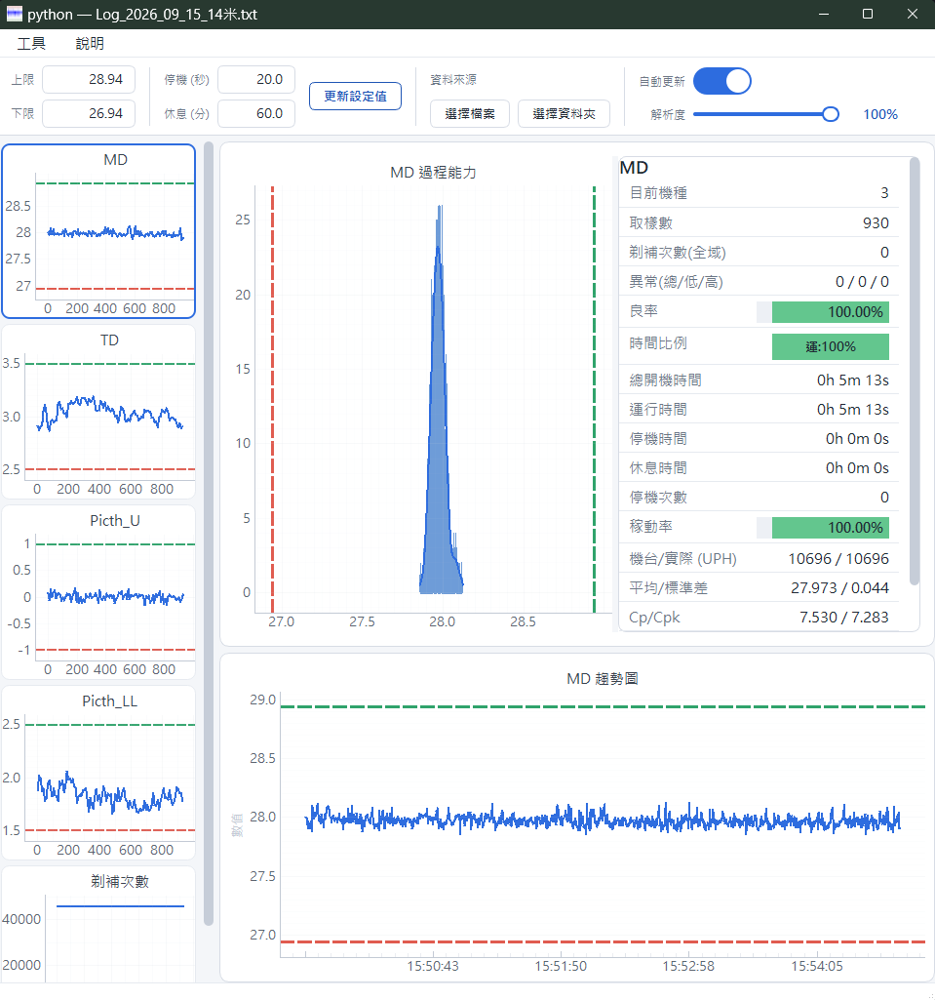

# 資料收集 — 更新紀錄

> 這一頁只講**改了什麼、你會看到什麼不一樣**,不講程式內部怎麼做的。
> 由新到舊排列。

## 6.2.1 · 2026-09-02

### 修正

- 「檔案摘要」視窗可以最大化了。以前檔案一多,長長的表格只能擠在固定大小的視窗裡捲。
- 「檔案摘要」上方四個門檻輸入框(稼動率、UPH、良率、Cpk)的數字會被切掉一半,現在完整顯示。

---

## 6.2.0 · 2026-09-01

### 介面

*換新外觀後的主畫面:左邊是各量測項目的小圖,中間是過程能力圖,右邊是即時數據。*

- 全面換新外觀:淺色底、卡片式面板、統一的字型和間距,看久了比較不累。
- 上方控制列的按鈕依用途分成四組,要找的功能比較好找。
- 能力圖和右邊的資訊欄中間可以用滑鼠拖曳,想看圖就把圖拉寬,想看數字就把數字欄拉寬。
- 紅、黃、綠三個燈號的顏色維持原本明亮的版本,遠遠看也分得出來。

### 讀檔與判讀

- 可以指定某個欄位要當成「文字」還是「數字」,現場 log 欄位格式不一致時不會再判錯。
- 新增的欄位預設就會出現在畫面上,不必再改程式才看得到。
- 某些格式的檔案讀取速度大幅提升,切換日期幾乎不用等。
- 趨勢圖和長條圖右邊的資訊欄統一了,同一個欄位在兩邊看到的數字一致。
- 沒有讀值的欄位(顯示 `Q:---(F)` 那種)不會再污染數值統計。
- 整列都是空的項目會自動隱藏,資訊欄不再一整排「—」。

---

## 6.1.0 · 2026-09-01

> 這一版沒有單獨發佈,內容併在 6.2.0 一起上線。

- 讀檔與欄位判讀的改善,詳見 6.2.0 的〈讀檔與判讀〉。

---

## 6.0.1 · 2026-08-31

### 修正

- 修正自動更新下載完之後換不了版、一直停在舊版的問題。
- 第一次安裝用的壓縮檔,解開來就是一個「資料收集」資料夾,整包搬去要放的位置就能用。

---

## 6.0.0 · 2026-08-31

### 新增

- **程式會自己更新了。** 開啟時會在背景看看有沒有新版,有的話跳出來問你要不要更新;
  按「是」之後程式會自己關掉、換成新版、再自動開回來,大約幾秒鐘,不用自己去抓檔案。
- 「工具 → 檢查更新」可以隨時自己按一次,確認手上是不是最新版。

---

## 6.0.0 以前的重點

沒有逐版記錄,但這幾件事影響最大:

- **大檔案不再卡頓。** 33 萬筆資料時,畫面更新從 2 秒多降到 0.08 秒左右。
- **修好「跑一整天沒事、隔天早上畫面就停住」。** 過了午夜換檔之後監控會斷掉,現在會自動接上新的檔案。
- **同一秒有多筆資料時順序會亂掉**,導致趨勢圖的線亂跳,已修正。
- **解析過的檔案會存快取**,第二次開同一天的資料幾乎是瞬間完成。
- 新增「工具 → 開啟快取資料夾」,快取想清掉可以自己刪,程式會重建。
